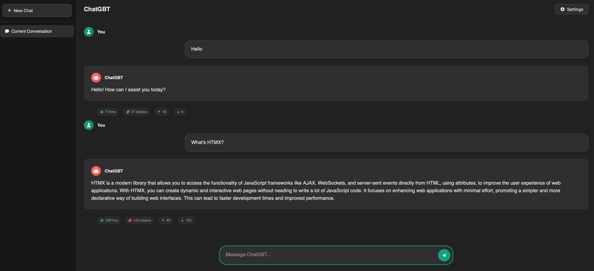

# Prompt Engineering in Practice: Building a ChatGPT-Style App in Go

After spending some time with LLMs, a few things kept getting in the way: conversations would stall out, I couldn’t tell what each run was costing, and the whole thing felt like a black box. That’s when I built ChatGBT (my prototype, not OpenAI’s product). The goal wasn’t to clone ChatGPT, but to separate prompt wording issues from architectural ones. I wanted something lean, without abstractions or [SDKs](https://github.com/openai/openai-go), so I could see how LLM interactions actually work behind the scenes.

---

## But, why?

Most of the time we use LLMs through polished UIs, where the defaults and prompt handling are already decided for us. Once you roll your own, you’re the one deciding how far the context goes, when to prune, how retries work, and what the UI says when it fails.

---

## Architecture (Go + Fiber + HTMX)

I wanted quick experimentation with minimal dependencies:

- Backend: Handles API calls and conversation state.
- CLI Mode: A lab for rapid testing.
- Web Mode: A lightweight frontend for everyday use.

The backend core looks like this:

```go
// Backend package - the heart of API interaction
package backend

// Message roles as defined in OpenAI Chat Completions API
type Role string

const (
    RoleSystem    Role = "system"    // System messages help set the behavior of the assistant
    RoleUser      Role = "user"      // User messages are requests or comments from the end-user  
    RoleAssistant Role = "assistant" // Assistant messages are responses from the AI assistant
    RoleTool      Role = "tool"      // Tool messages contain results from tool/function calls
)

// LLMConfig holds configuration for OpenAI API interactions
type LLMConfig struct {
    APIKey    string `json:"api_key"`    // OpenAI API key for authentication
    URL       string `json:"url"`        // API endpoint URL
    Model     string `json:"model"`      // Model identifier (e.g., "gpt-4o-mini")
    ShowUsage bool   `json:"show_usage"` // Whether to return token usage information
}

// Message represents a single message in the conversation
type Message struct {
    Role    Role   `json:"role"`              // The role of the message author
    Content string `json:"content"`           // The contents of the message
}

func ChatWithLLM(cfg LLMConfig, messages []Message) (string, error) {
    // Direct conversation with the model's API
    resp, err := makeRequest(cfg, messages)
    if err != nil {
        return "", err
    }
    return resp.Choices[0].Message.Content, nil
}
```

The OpenAI Chat [Completions API](https://platform.openai.com/docs/api-reference/chat/create) takes an array of messages, each tagged with a role:

- System: Sets the behavior of the assistant
- User: Your input
- Assistant: The model’s reply 
- Tool: Results from your app’s tools or functions, passed back in when function calling is enabled

To preserve context, you resend relevant messages each call, usually a mix of recent exchanges plus a running summary to stay inside the context window.

One detail worth knowing: the JSON you send doesn’t feed straight into the model. The API reformats it using the same conventions the models were trained on (ChatML). You don’t need to handle ChatML yourself, but it explains why roles matter and why the order of messages is enforced.

That’s why I kept both CLI and web modes sharing the same conversation logic. The interface changed, but the way messages were structured didn’t. And that’s the bigger lesson, prompt engineering isn’t about clever wording, it’s about how you manage the flow of the whole conversation.

---

### Two Modes

**CLI Mode: The Rapid Iteration Lab**

Supports interactive chat and one-off queries.

**Interactive Chat Mode:**

Provides commands like `/reset`, `/budget`, `/stats`, `/prune`.

```bash
⇨  go run main.go cli

 ██████╗██╗  ██╗ █████╗ ████████╗ ██████╗ ██████╗ ████████╗
██╔════╝██║  ██║██╔══██╗╚══██╔══╝██╔════╝ ██╔══██╗╚══██╔══╝
██║     ███████║███████║   ██║   ██║  ███╗██████╔╝   ██║   
██║     ██╔══██║██╔══██║   ██║   ██║   ██║██╔══██╗   ██║   
╚██████╗██║  ██║██║  ██║   ██║   ╚██████╔╝██████╔╝   ██║   
 ╚═════╝╚═╝  ╚═╝╚═╝  ╚═╝   ╚═╝    ╚═════╝ ╚═════╝    ╚═╝   
                                                            
        🤖 Language Model Assistant for Educational Purposes
        ━━━━━━━━━━━━━━━━━━━━━━━━━━━━━━━━━━━━━━━━━━━━━━━━━━━━
Welcome to the interactive LLM chat!
Commands: 'exit', '/reset', '/system', '/budget', '/stats', '/prune'

You (end with empty line):

```

**Quick Query Mode:**

The CLI made iteration fast: type, test, tweak.

```bash
$ go run main.go "explain Go channels"
Tokens: 342 | Cost: $0.0041 | Time: 1.2s

$ go run main.go "debug this code: [paste]"
Tokens: 511 | Cost: $0.0056 | Time: 0.8s
```

**Web Mode: Making It Real**

The web UI introduced challenges around context management, error handling, and responsiveness.

<p align="center">
  
</p>

This is the core chat handler that ties everything together:

```go
func (s *Server) handleChat(c *fiber.Ctx) error {
    userMessage := c.FormValue("message")

    // Check if we should prune before adding new input
    if s.contextManager.ShouldPrune(s.messages) {
        newMessages, _ := s.contextManager.PruneContext(s.messages)
        s.messages = newMessages
    }

    // Add user message to conversation
    s.messages = append(s.messages, backend.Message{
        Role:    backend.RoleUser,
        Content: userMessage,
    })

    // Get AI response with timing
    startTime := time.Now()
    reply, usage, err := backend.ChatWithLLMWithUsage(s.cfg, s.messages)
    responseTime := time.Since(startTime)

    // Track metrics for budget monitoring
    s.metrics.LogInteraction(usage, responseTime, err == nil, "", "general")

    if err != nil {
        return s.renderError(c, err)
    }

    // Return both messages as HTMX partial update
    return s.renderComponent(c, templates.ChatResponseComponent(
        userMessage, reply, usage, responseTime,
    ))
}
```

The web mode automated pruning, budget warnings, and error recovery: things that were manual in the CLI. Together, the two modes taught me how design decisions shift with context.

---

## Lessons Learned

### Context Management
Keep full conversation history and costs explode. Cut too aggressively and the model forgets important context. One conversation, 20 messages back and forth, cost me $0.15 in tokens. Most of that was repeating content the model had already seen. 

### Speed Drives Quality
Faster iteration → better prompts. The faster you can test ideas, the better your prompts get.

### Prompts Improve With Real Use
Specific instructions outperformed “role-playing” prompts. Example:

**Bad:** `Act like a senior engineer, fix this error.`
**Good:** `Go handler throws 500 on empty form submit. What's the likely nil pointer and simple fix?`

The same applied when I was working on the web interface. Asking for generic design help gave me fluff, but precise prompts about my stack delivered useful results:

**Bad:**  `Make this look like ChatGPT.`
**Good:** `Using HTMX and Templ, show me how to structure a dark-mode chat bubble layout with user messages right-aligned and assistant messages left-aligned. Minimal CSS, no JavaScript.`

Bottom line? Skip the personality theater and be specific about what you need. The model doesn’t need to “act like” anything; it needs clear, actionable instructions that line up with your actual code and tools.

---

## Using AI to Build AI Stuff

Frontend isn’t my strong suit. Instead of fighting CSS/JS, I asked Claude for help designing a Templ-based dark-mode chat layout. The model showed me reusable component patterns:

**Me:** "I need to build a dark-themed chat interface that works like ChatGPT. I'm using Go with Fiber for the backend, HTMX for interactivity, and Templ for templates. I want real-time message updates without full page refreshes. I'm not great with CSS, and I definitely don't want to touch JavaScript if I can avoid it. Can you help me think through this?"

**Claude:** "Absolutely! For a ChatGPT-style interface, you'll want to think in terms of message bubbles with different alignments for user vs assistant. I can show you a Templ structure that'll give you that modern chat layout..."

The response wasn't just code; it included explanations I'd never heard before:

```go
// Role-based message rendering with conditional logic
templ MessageComponent(role, content string) {
    <div class={ "message", role }>
        <div class="message-header">
            <div class={ "avatar", role }>
                if role == "user" {
                    <i class="fas fa-user"></i>
                } else {
                    <i class="fas fa-robot"></i>
                }
            </div>
        </div>
        <div class="message-content">
            if role == "assistant" {
                @templ.Raw(markdownToHTML(content))
            } else {
                { content }
            }
        </div>
    </div>
}
```

With detailed explanations about conditional rendering in templates.

```go
// Before: Manual HTML strings
return c.SendString("<div class='message'>" + content + "</div>")

// After: Clean component pattern
return s.renderComponent(c, templates.MessageComponent(role, content))
```

The model didn't just solve my immediate problem; it showed me reusable techniques. Instead of copy-pasting code, I was learning by building.

IMPORTANT: stay in control of the code. If the model generates something you don’t fully understand, that’s a red flag. Stop and reassess. Writing new code is cheap; maintaining mysterious code in production is expensive. The last thing you want is a critical bug at 2 AM in a module no one on your team can explain.

---

## The Stuff I Messed Up

**1. Token Budgets Are Critical**
At first I mostly focused on getting things working and didn’t pay much attention to cost. A few longer conversations later, I noticed the bill creeping up.

That pushed me to think about efficiency earlier: shorter context windows, smarter summarization, and pruning conversations. The current version includes `TOKEN_BUDGET` and `COST_BUDGET` environment variables that give a heads-up when you’re getting close to limits.

**2. Retry Storm**
A corrupted API key caused endless retries. It cleared my entire scrollback history. It wasn’t sending conversation data anywhere, but it was probably hammering the auth endpoint unnecessarily.. I just hadn't thought to validate the key format at startup. Now it checks and fails fast with clear error messages.

**3. CLI Input Quirks**
The CLI uses an empty new line to signal the end of a message. That works fine when you’re typing, but it gets awkward if you paste text that already contains blank lines. It’s a small thing, but one that makes the input experience less smooth and worth revisiting.

**4. Future-Proofing the API**
If I were starting over, I’d probably build on top of the OpenAI Responses API instead of the older chat endpoint. It combines text, tools, and other modalities in one place, which makes the design easier to maintain and more flexible for future changes. Switching now would take extra work, but starting with it would have been cleaner.

**5. Future API Capabilities to Explore**
There are features I didn’t touch the first time around but definitely want to try:
* **`stream`:** Send tokens as they’re generated. It makes the app feel more responsive since users can start reading before the full response is ready.
* **`temperature`:** Controls how deterministic the output is. At `0`, responses can be repetitive; higher values add variety, though very high values often get incoherent.
* **`n`:** Generate multiple completions in parallel. Handy when testing prompts, since you can compare options side by side. It’s faster than rerunning requests manually, though you still pay for all the tokens.

I skipped these at first to keep the scope small, but they’re worth exploring to improve both the user experience and the way prompts are tested.

---

## Costs

Let's talk money. I was curious about costs too, so I tracked everything.

**gpt-4o-mini** costs about $0.15 per million input tokens and $0.60 per million output tokens. **gpt-3.5-turbo** runs roughly $0.50 input, $1.50 output per million tokens.

In real conversations:

**Simple Q&A** (~1k tokens in, 500 out): Under a penny with gpt-4o-mini, maybe $0.0015 with Turbo.

**Code debugging sessions** (5-7 back-and-forth exchanges): $0.01-$0.02 with gpt-4o-mini, $0.05-$0.10 with Turbo.

**Long creative sessions**: Under $0.10 with gpt-4o-mini, $0.20-$0.40 with Turbo.

With `gpt-4o-mini`, you’re usually spending well under $0.01, and design choices (like pruning or summarization) matter more than raw model cost. With Turbo, the bill adds up faster.

My current `.env` setup looks like this:

```
OPENAI_API_KEY=your_api_key_here
MODEL=gpt-4o-mini
TOKEN_BUDGET=100000   # ~100k tokens/run, enough for 5–10 medium conversations
COST_BUDGET=2.00      # ~2 dollars/run cap to catch runaway costs
PORT=3000
```

These defaults are safe for development and light daily use. If you scale to heavier workloads, tune `TOKEN_BUDGET` down (e.g. 50k) for tighter guardrails, or bump `COST_BUDGET` up if you want more breathing room.

---

## Ops Basics

Building **ChatGBT** meant thinking through some operational basics:

- **API Keys:** Keep them in environment variables or secret manager, never in code
- **Logging:** Capture errors and metrics, but strip out user inputs and model outputs (redact sensitive data)
- **Input Validation:** Treat prompts like untrusted input; simple attacks like “ignore previous instructions” can trip you up.
- **Retries:** Use exponential backoff with jitter (3–5 tries max) and set reasonable timeouts.
- **Data:** Don’t store full transcripts unless you have to, and encrypt them if you do.
- **Rate Limits:** Design for graceful degradation when limits hit


---

## If You're a Manager

I put this together for under ~$20 and a couple of weekends. That was enough to give me the context to weigh in on $100K platform decisions.

Model literacy isn’t about memorizing model names or buzzwords. It’s knowing how prompt design changes outcomes, how context windows drive cost and accuracy, and how these things fit into real workflows. The only way to learn that is to build something, break it, and see what happens.

The real takeaway wasn’t ending up with a ChatGPT clone. It was all the things that went wrong along the way, and learning how to fix them. That’s where you start to really understand how these systems behave


---

## What **ChatGBT** Can Do Today

The finished project isn't groundbreaking, but it's useful. 

- **CLI Mode**: Quick tests and code reviews.
- **Web Mode**: Workshops and demos. It handles conversation context intelligently, fails gracefully when the API is down, and costs pennies to run. 


More importantly, I understand every line of code and every design decision.


---

Building this drove home that the value isn’t in having every answer, it’s in learning how to ask better questions. And the best way I’ve found to do that is by building something that help me ask them.

